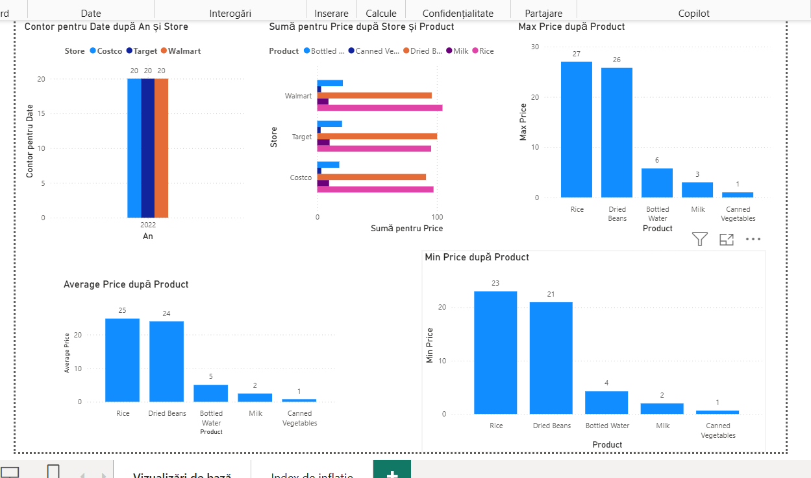
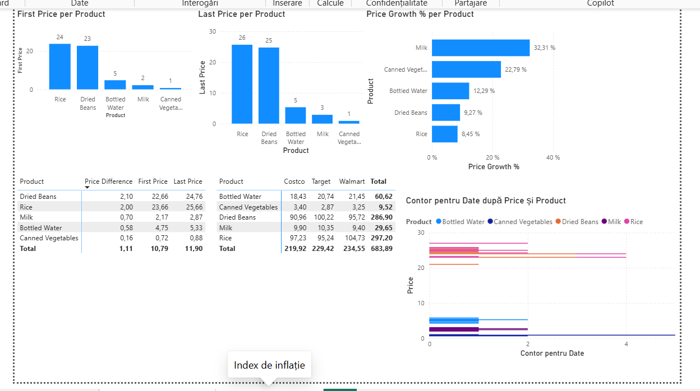

# 🛒 Retail Price & Inflation Tracker (Power BI)

## 📌 Despre Proiect
Acest proiect reprezintă un raport interactiv realizat în **Power BI Desktop**, având ca scop monitorizarea și analiza evoluției prețurilor pentru produse alimentare de bază în cursul anului 2022, în trei mari rețele de retail: **Walmart**, **Costco** și **Target**.

Proiectul evaluează dinamica prețurilor, diferențele dintre magazine și calculează indicele de inflație la nivel de produs utilizând formule avansate în limbajul **DAX (Data Analysis Expressions)**.

---

## 🛠️ Ce am realizat în acest proiect?

1. **Curățarea și Structurarea Datelor:**
   * Importul setului de date din Excel și validarea tipurilor de date (Dată calendaristică, Text, Număr zecimal/Valută).

2. **Crearea Măsurilor DAX (Calculul Metricilor Cheie):**
   * **Calculul valorilor de bază:** Prețul mediu (`AVERAGE`), prețul minim (`MIN`) și prețul maxim (`MAX`) per produs și magazin.
   * **Calculul Indicelui de Inflație (Time Intelligence logic):**
     * `First Price`: Identifică automat prețul de la prima dată înregistrată în intervalul selectat.
     * `Last Price`: Identifică automat prețul de la ultima dată înregistrată.
     * `Price Difference`: Calculează variația absolută de preț (`Last Price - First Price`).
     * `Price Growth %`: Determină procentul de creștere/scădere a prețului pe parcursul anului (`DIVIDE(Price Difference, First Price)`).

3. **Construirea Raportului Visual și a Dashboard-ului:**
   * Structurarea analizei în două pagini distincte: **Vizualizări de bază** și **Index de inflație**.

---

## 📊 Pagini și Vizualizări din Dashboard

### 1. Vizualizări de bază (Overview & Baseline Analytics)
Această pagină oferă o imagine de ansamblu asupra volumului de date, distribuției pe magazine și valorilor statistice ale prețurilor.

* **Analize incluse:**
  * **Volumul înregistrărilor:** Distribuția numărului de înregistrări temporale pe fiecare magazin (*Costco*, *Target*, *Walmart*).
  * **Prețul mediu per produs:** Compararea costului mediu de achiziție pentru produsele analizate (*Rice*, *Dried Beans*, *Bottled Water*, *Milk*, *Canned Vegetables*).
  * **Extremele de preț:** Grafice dedicate pentru vizualizarea prețului maxim și minim înregistrat pentru fiecare produs.

---

### 2. Index de inflație (Inflation & Price Dynamics)
A doua pagină este axată pe analiza dinamicii financiare și a ratei inflației pe parcursul anului 2022.

* **Analize incluse:**
  * **Price Growth % per Product:** Clasamentul produselor după rata de scumpire (ex: *Milk* ~32.31%, *Canned Vegetables* ~22.79%).
  * **Matrix - Variație de Preț:** Tabel detaliat ce afișează `First Price`, `Last Price` și diferența netă (`Price Difference`) per produs.
  * **Matrix - Comparativ pe Magazine:** Analiza comparativă a prețurilor medii între rețelele de magazine (*Costco* vs. *Target* vs. *Walmart*).
